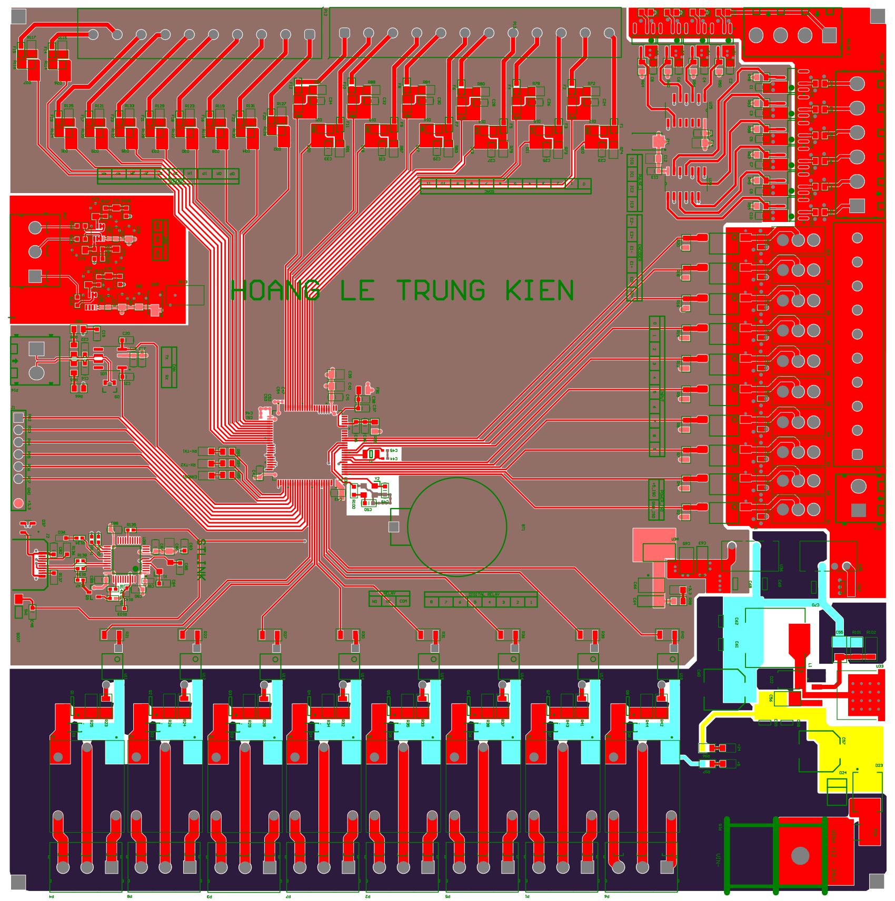
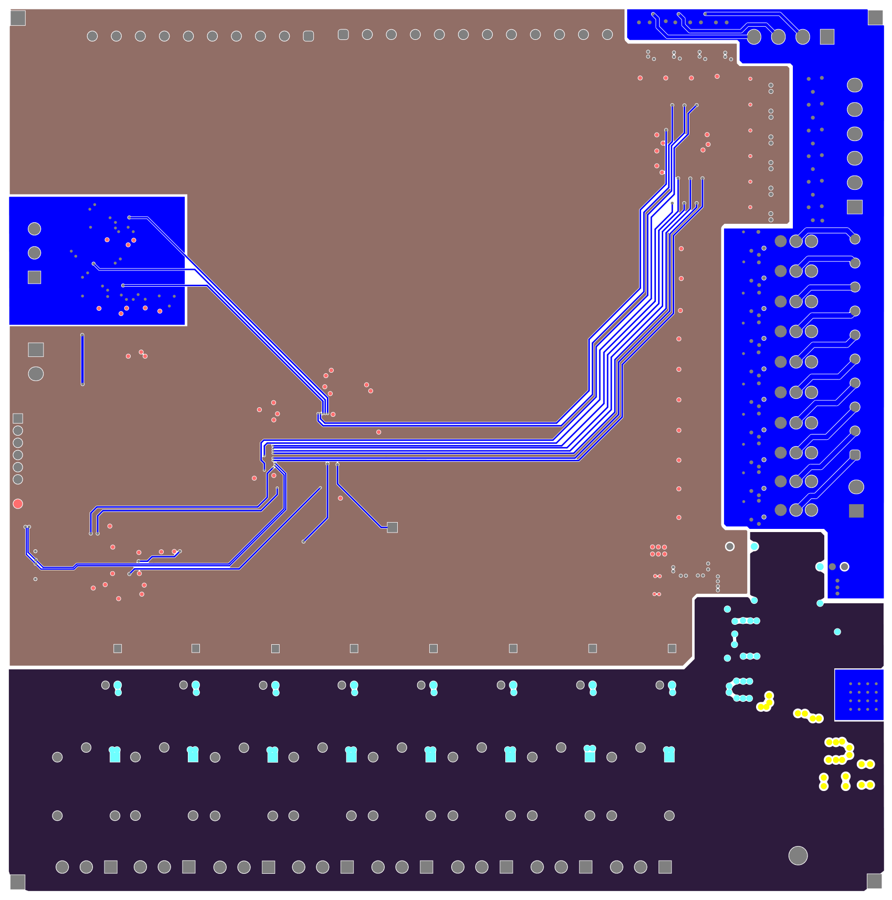
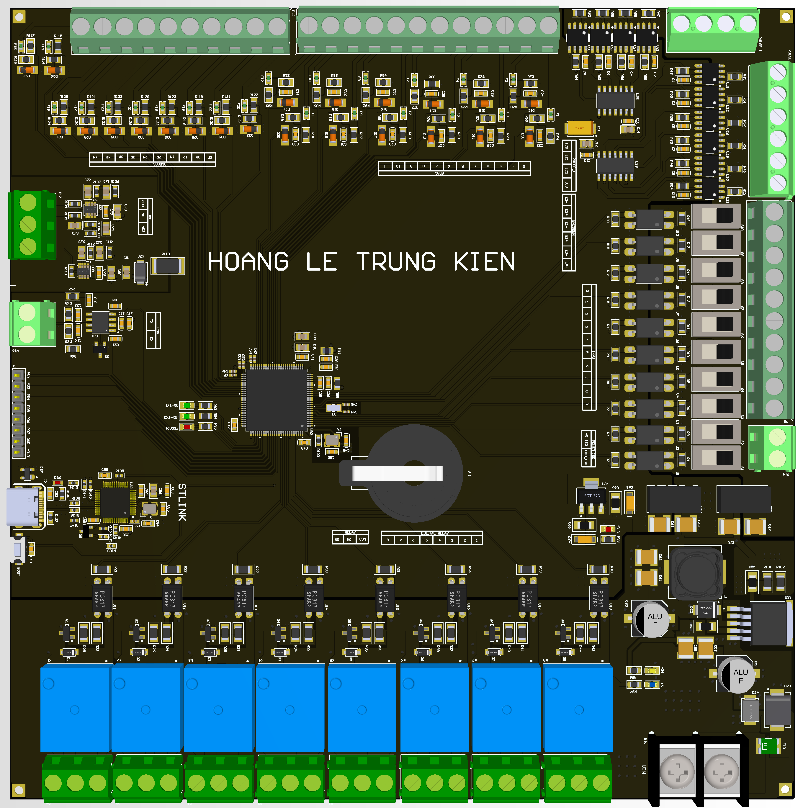
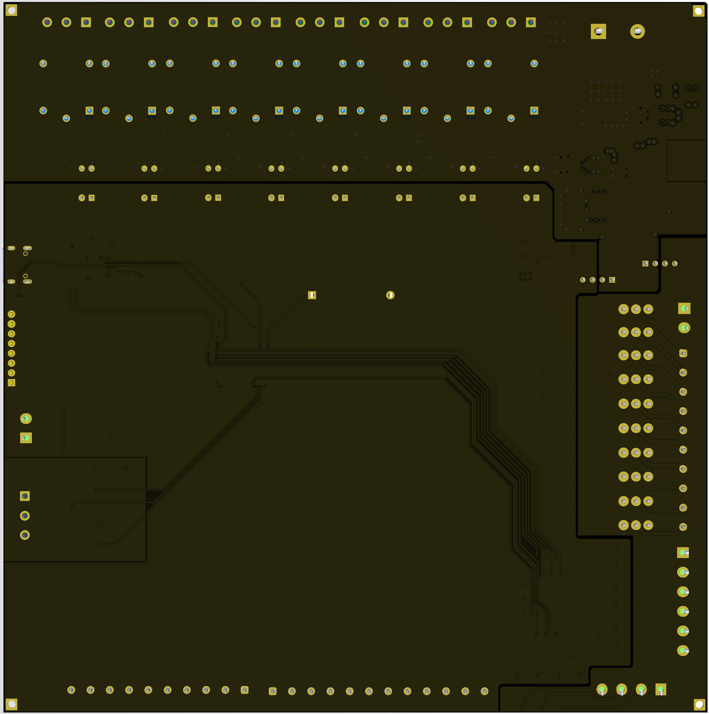

# Industrial Mixed-Signal DAQ & Controller Board (STM32F373)

> **Status: Design complete — pre-fabrication.**
> Schematic and PCB layout are finalized. Board has not yet been
> manufactured or tested. All architecture descriptions reflect
> design intent, not measured performance.

---

### PCB Top Layer

<p align="center">
  
</p>

### PCB Bottom Layer

<p align="center">
  
</p>

### 3D Top View

<p align="center">
  
</p>

### 3D Bottom View

<p align="center">
  
</p>

## Overview

| Parameter            | Value                                      |
|----------------------|--------------------------------------------|
| MCU                  | STM32F373V8T6 (Cortex-M4, DSP, FPU)       |
| Supply voltage       | 24 VDC nominal                             |
| Analog inputs        | 6 × differential 4–20 mA (16-bit SDADC)   |
| Digital inputs       | 10 × isolated (PC817)                      |
| High-speed inputs    | 7 × pulse/encoder (6N137 + 74HC14)        |
| Relay outputs        | 8 × SPDT, optically isolated gate drive   |
| Communication        | CAN (TCAN332D), SPI expansion header       |
| Debug                | SWD (ST-Link), USB Type-C                 |
| Isolation domains    | 3 (logic, I/O, relay)                      |
| Layer count          | 4-layer                                    |

## System Architecture

### 1. Power distribution and isolation domains

The board uses three strictly separated power and ground domains
to prevent relay switching transients from coupling into the
analog front-end:

- **Main domain (`GND`):** MCU, analog circuitry, communication
  interfaces. 24 V → 5 V via XL4015 buck, 5 V → 3.3 V via AMS1117.
- **I/O domain (`GND_ISO`):** Fed by a B0505S-1WR3 isolated DC-DC.
  Services all digital input optocouplers and high-speed capture
  circuits.
- **Relay domain (`GND_PWR`):** Fed by a second B0505S-1WR3.
  Drives relay coils. Inductive flyback is confined to this domain.

No PCB traces cross the isolation boundary. Creepage and clearance
rules are enforced across all barrier gaps.

### 2. Analog front-end (AFE)

4–20 mA current loops are terminated across precision 160 Ω
resistors, producing a 0.64–3.2 V differential swing directly
compatible with the STM32's SDADC inputs.

Each channel includes:
- PTC resettable fuse for overcurrent protection
- 3.6 V Zener diode to clamp transient overvoltages before the MCU

The SDADC differential input topology eliminates the need for an
external ADC and provides inherent common-mode rejection.

### 3. Digital I/O and high-speed capture

- **Standard digital inputs (10 ch):** PC817 optocouplers.
- **High-speed inputs (7 ch):** 6N137 optocouplers for low
  propagation delay, followed by 74HC14 Schmitt triggers for
  hardware edge squaring. Removes software debouncing requirement
  on encoder and pulse capture channels.
- **Relay outputs (8 ch):** SPDT relays driven by 2N7002 N-channel
  MOSFETs with optically isolated gate drive. Flyback diodes on
  each coil.

### 4. EMI/EMC and transient protection

| Location               | Component         | Function                        |
|------------------------|-------------------|---------------------------------|
| 24 V power entry       | SMBJ36CA TVS      | Bulk transient suppression      |
| CAN bus                | PESD5V0L2BT       | ESD protection (dual TVS array) |
| CAN termination        | Split topology    | Common-mode noise reduction     |
| Per analog channel     | PTC + 3.6 V Zener | AFE overvoltage/overcurrent      |

PCB layout practices:
- Continuous ground planes with via stitching on all domains
- Decoupling capacitors placed at MCU and IC supply pins to
  minimize loop inductance
- No routing across split plane boundaries

## Known limitations and open items

- Board is pre-fabrication. Isolation effectiveness under actual
  relay switching has not been measured.
- B0505S-1WR3 is a 1 W converter; total I/O-side current budget
  needs verification against worst-case optocoupler load.
- CAN split-termination values selected by calculation;
  common-mode rejection to be validated on prototype.

## Repository structure

```text
    top_layer.png
    bottom_layer.png
    3d_top.png
    3d_bottom.png
